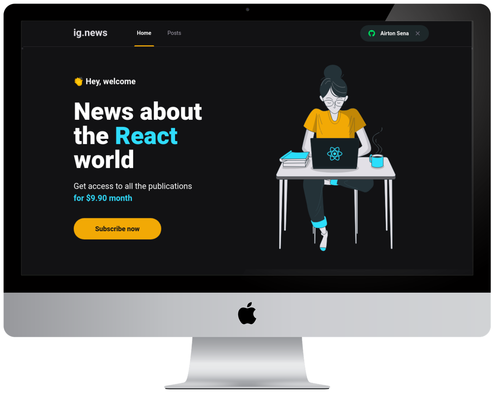

<h1 align="center">
    
</h1> 
 
<h1 align="center">
    
</h1>

## 💻 Projeto

 projeto tem como objetivo o estudo e desenvolvimento de uma aplicação em ReactJS com NextJS para listagem de posts e sistema de inscrição(subscription).

 

## 📚 Tecnologias
- [Next.js](https://nextjs.org/)
- [React](https://pt-br.reactjs.org/)
- [Typescript](https://www.typescriptlang.org/)
- [Sass](https://sass-lang.com/)
- [Axios](https://github.com/axios/axios)
- [NextAuth.js](https://next-auth.js.org/getting-started/example)
- [FaunaDB](https://fauna.com/)
- [Stripe](https://stripe.com/br)
- [Prismic](https://prismic.io/)

 

